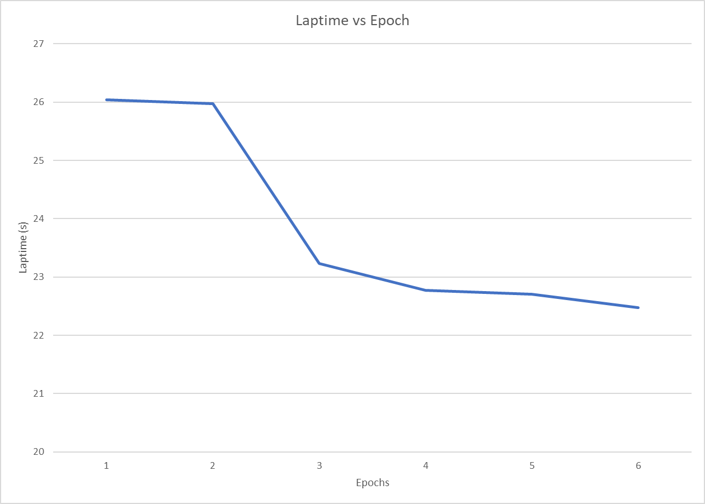

# PonyCar
This project provides a framework for controlling a four-wheel vehicle with Ackermann steering with an RGB camera.  Examples of such cars can be found here.  This project is largely focused on improving laps around a predetermined tracks.  Images of example tracks can be found here.

## RGB Camera
This project uses an RGB camera which is then scaled down to 160x120 to reduce evaluation time for functionality which uses this camera.

## Manual Control
In order to provide for a means of user control for collecting data, we introduce a joystick-based control model based upon PyGame.  Driving with this mode stores a scaled-down image of the camera and the controller inputs at a frequency of 15 Hz.

## Autonomous Control
In order to allow for autonomous control, we provide a three-layer network.  The first layer has 160x120x3 input nodes to take input from the RGB camera.  The second layer has 100 hidden nodes.  The final layer provides 2 output notes to control the steering and throttle of the vehicle.  The network is evaluated at a rate of 15 Hz.

### Refinfocement
With the goal of reducing progressive laptimes, we reward faster lap segments and heavily penalize any time the car attempts to leave the track.  In order to detect the track, we have added additional OpenCV processing to detect the lane, detect track segment, and detect start/finish line.

The reinfocement learning code assumes a pretrained model using supervised learning as a starting point.  This was selected to make the reinforement training simplier than starting from scratch.

#### Laptime Plot

## Summary of Code
The main entry point for the car code is `rl.py`.  All packages are defined in the `pyproject.toml` file.  In order to peform training, we will use `train.py`.

In `rl.py`, line 33 and line 34 controls which driver is used for driving the vehicle.  Line 58 controls if the car saves data.

